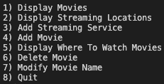

# Overview

I decided to write this program so that I could integrate my SQL skills with my programming skills. I chose to use Python since it is a simple language so that I could learn the concepts of how to integrate it with an SQL relational database. My goal with learning that is to be able to have my databases actually have purpose with the ability to add them to a website or program. I use the sqlite3 library to integrate SQL with Python. 

To use the program, you select the menu option that you want to do. Adding data will ask for each item individually. To add a movie, you need to know the streaming service id, so you will want to do display streaming locations first to view that.

[Software Demo Video](http://youtube.link.goes.here)

# Relational Database

This database is to enter movies into and the streaming services that they are on so that you can know where to go to watch the movie. There are 2 tables in this database. 

The parent table is called service. It contains the following information:
* studioId
* studioName

There is also a movie table that contains the following data:
* movieId
* movieName
* movieStudio
* movieYear
* serviceId

The serviceId is how the movie table is linked to the service table so that it can be joined using a Join statement.

# Development Environment

* Visual Studio Code
* SQLite 3
* Python 3.10.0
* GitHub

# Useful Websites

* [Python Library Documentation](https://docs.python.org/3.8/library/sqlite3.html)
* [W3 Schools](https://www.w3schools.com/sql/)
* [SQLite Tutorials](https://www.tutorialspoint.com/sqlite/sqlite_python.htm)

# Future Work

* The functionality to see how many movies are on each streaming service
* The functionality to have the cost of subscription for each service, and then do the math to see how much it would cost for the combination of desired services
* Use the connection as a context manager to not allow duplicate movies or streaming services